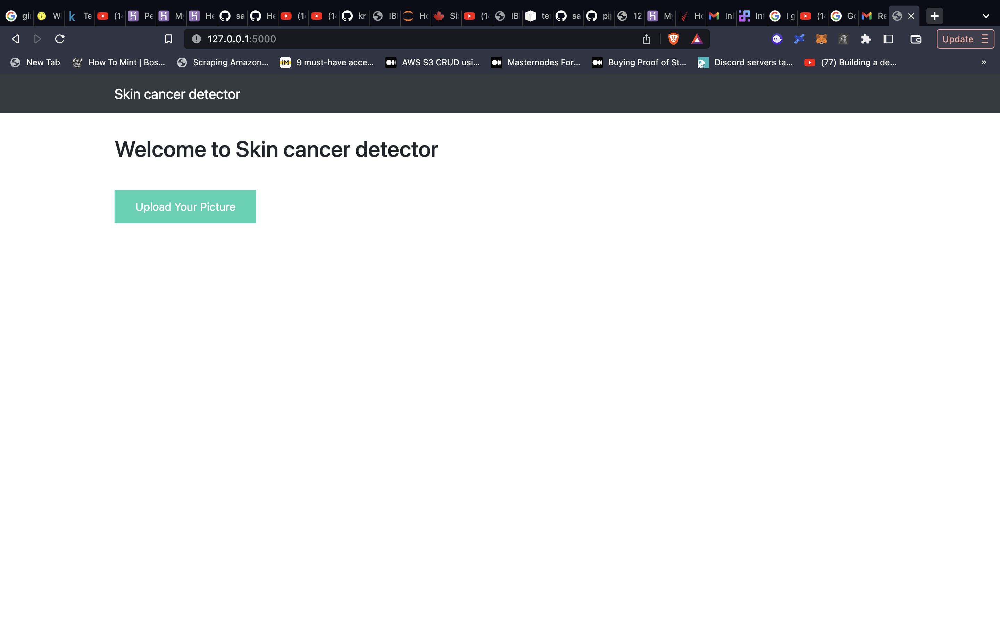
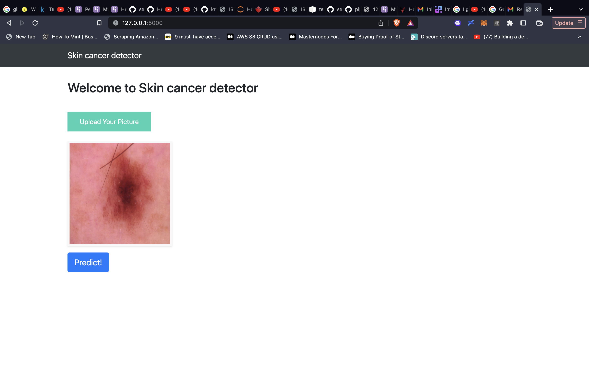

# Cancer Detector

Project Organization
------------

    ├── LICENSE
    ├── README.md          <- The top-level README for developers using this project.
    ├── app.py             <- Flask app
    │
    │
    ├── models             <- Trained and serialized models, model predictions, or model summaries
    ├── static             <- Contains CSS and Java script
    ├── templates          <- Contains HTML
    ├── notebooks          <- Jupyter notebooks. Naming convention is a number (for ordering),
--------

